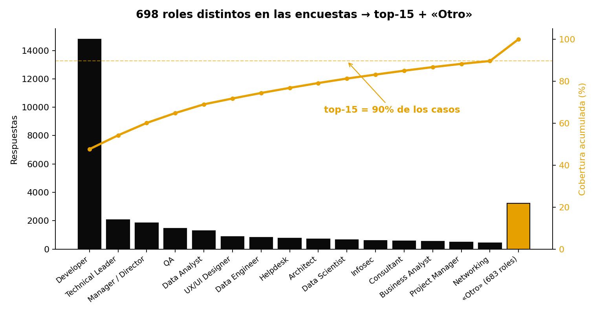
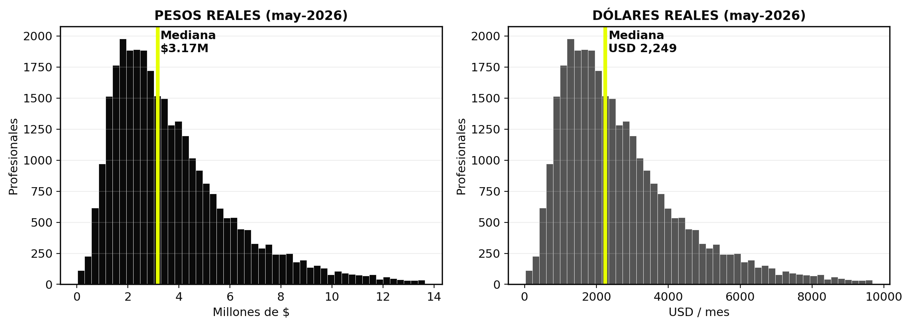
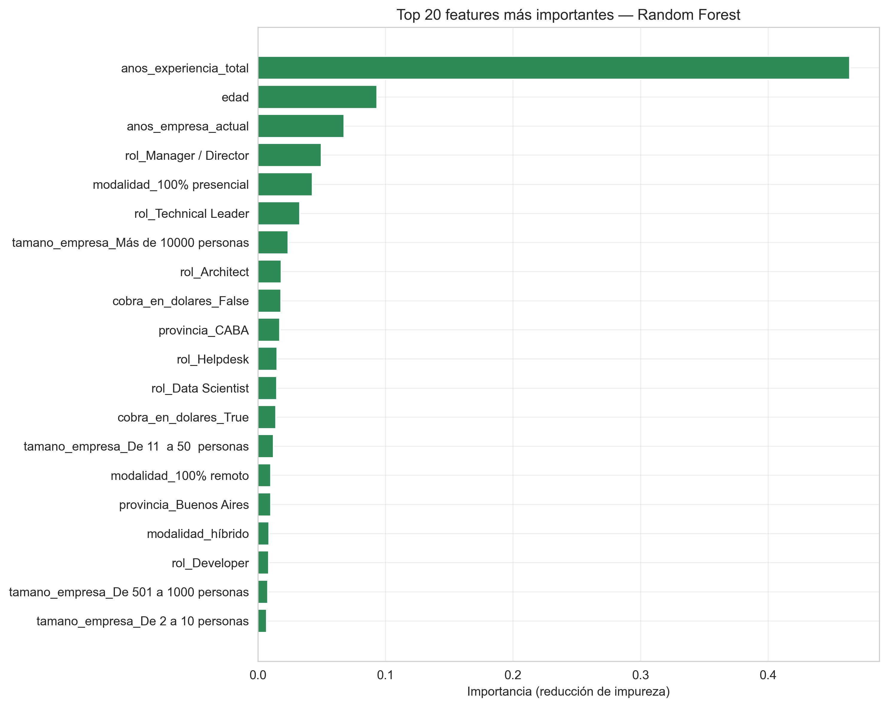
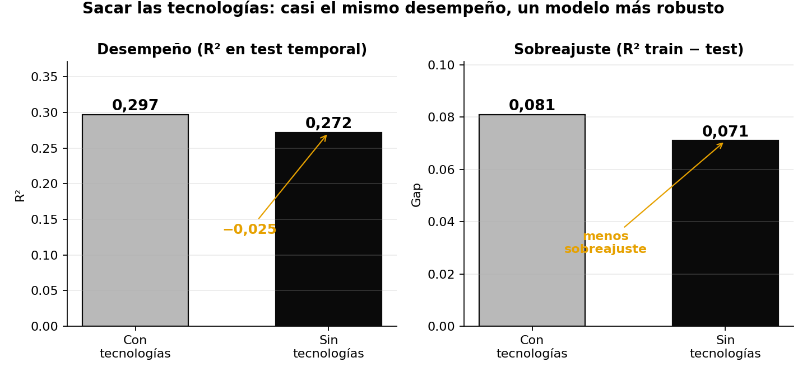
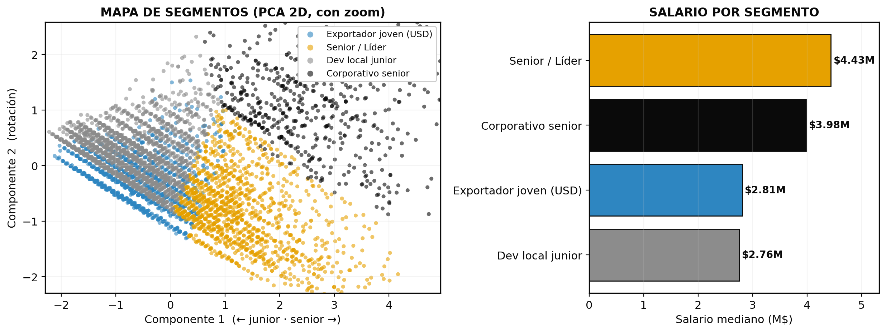
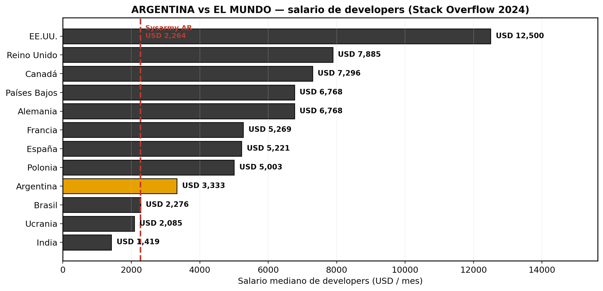

# Argentine Tech Labor Market 🇦🇷 — Salary Analysis & Prediction

**Data Mining — Final Project (TPO) | UADE 2026**
*Team: Franco Massi · Santiago Barbera · Ignacio Beluge · Bautista Oliveto · Esteban Gueicha · Benjamin Martinez*

**[🇬🇧 English](#english) · [🇦🇷 Español](#español)**

---

<a name="english"></a>
# 🇬🇧 English

## Executive summary

This project integrates six editions of the **Sysarmy salary survey (2022–2025)** with eight macroeconomic series to build a single, clean, time-comparable dataset of **31,088 Argentine tech professionals**. Every salary is expressed in **real terms** (constant May-2026 pesos and dollars), neutralizing accumulated inflation above 900% and the sharp exchange-rate swings of the period.

On that base we built two models: a **Random Forest** (supervised) that estimates a salary from a profile, and a **K-Means segmentation** (unsupervised) that discovers the market's archetypes. Results are delivered through a **Streamlit web app**, in Spanish/pesos and English/dollars versions.

**Central finding:** the profile explains about **27%** of salary variation — experience and leadership roles dominate — and, against intuition, being paid in dollars did not bring more stability during the period.

## 1. Domain and problem

The Argentine tech sector is dynamic, with high turnover and international exposure. Its salaries are tied to a very volatile macroeconomy, which creates a concrete problem: **there is no integrated, time-comparable salary information**. Each survey edition is in the pesos of its moment, with a different price level and exchange rate, so nominal comparisons are meaningless.

- Fragmented sources (survey + scattered macro data).
- No measure of *real* salary comparable across periods.
- No tool that turns a profile into a market estimate.

## 2. Hypotheses

**Central hypothesis:** the real salary of a tech professional is determined by their work profile (role, experience) and their context (province, work mode, company size), once expressed in constant currency so that editions are comparable.

| # | Hypothesis | Verdict |
|---|-----------|---------|
| H1 | Seniority/experience is the most predictive variable | ✅ Confirmed — distributions barely overlap; strongest predictor |
| H2 | Experience has diminishing returns | ✅ Confirmed — 0→3 yrs: +85%; 10→13 yrs: +3% (plateau) |
| H3 | Some technologies carry a salary premium | 🟡 Partial — real premium, but led by Go/Rust, not just Python |
| H4 | CABA pays more than the interior, but less than believed | ✅ Confirmed — +24%; remote +43% in USD |
| H5 | USD earners have more stable purchasing power | ❌ Refuted — dollarized profiles showed MORE real volatility (CV 0.23 vs 0.14) |
| H6 | When the real exchange rate (ITCRM) rises, USD salaries rise | 🟡 Hint — correlation 0.70 but not significant (n=6) |

## 3. Proposal and business value

A reproducible pipeline unifies the six editions with eight macro series, produces a single analytical dataset and feeds the predictive model, the segmentation and the app. Value for management:

- Objective salary benchmarking for offers and retention.
- Identification of gaps and of the factors that move salaries.
- Reading of the macro impact (dollar, real exchange rate) on talent cost.
- A living tool that retrains with every new survey edition.

## 4. Pipeline architecture and sources

Flow: **(1) download → (2) cleaning & unification → (3) adjustment to real values (May-2026 base) → (4) final dataset** plus a macro-context table linked by edition date.

| Source | Contribution |
|--------|--------------|
| [Sysarmy](https://sysarmy.com) (6 editions) | Salaries and profiles — 31,088 responses |
| IPC INDEC | Argentine inflation (peso deflator) |
| MEP/Blue dollar (bluelytics) | Historical exchange rate |
| US CPI (FRED) | US inflation (dollar deflator) |
| CBT INDEC | Basic food basket |
| RIPTE | Average formal salary (benchmark) |
| Big Mac Index | Purchasing-power parity |
| ITCRM (BCRA) | Real multilateral exchange rate |
| [Stack Overflow Survey](https://survey.stackoverflow.co) | International benchmark |

> **Reproducibility:** raw CSVs are not versioned (the Stack Overflow one weighs 140 MB, above GitHub's limit), but every source has a lightweight **`.parquet` twin in `data/raw/`** (140 MB → 11 MB). The pipeline falls back to it automatically: **cloning the repo is enough to reproduce the whole project.**

## 5. Data cleaning

The main complexity was not dirty data — most fields are controlled dropdowns — but making heterogeneous sources comparable. From **32,309 raw rows to 31,088 final ones (only 3.8% discarded)**. Key decisions:

- **Schema harmonization:** each edition had 43–56 differently-named columns; they were mapped to one schema by token matching.
- **Parsing and typing:** salary from text to number, dates, text normalization.
- **Missing values:** row removal for critical columns (province, salary); median/mode imputation for the rest.
- **Native-currency adjustment:** a dollarized salary does not lose value with local inflation; it is deflated by the inflation of its own currency, keeping the peso/dollar ratio a coherent exchange rate.
- **Outliers:** kept and flagged; only evident data-entry errors are dropped (>50× the median — e.g. "300" meaning 300,000, or USD typed in the pesos field). Old editions (2022–2023) lost 5–8% for this reason; since 2024 the form validates the field and the discard rate is near zero.

## 6. Feature engineering

Each transformation has a concrete justification:

- **Technologies — EXCLUDED from the model:** evaluated as multi-hot (top 20) but excluded from the final model: their premium is a proxy of context (backend/dollarized companies) and as inputs they produced noise in atypical profiles (ticking "Go" on a helpdesk profile inflated the estimate towards a combination that does not exist). Removing them barely changes performance (R² 0.30 → 0.27) and yields a more robust model. The descriptive analysis remains in the EDA (H3).
- **Role grouping (698 → top 15 + "Other"):** rare categories produce noisy dummies and overfitting; the top 15 already cover 90% of records.
- **Province grouping (<100 records → "Other"):** same rationale.
- **One-hot encoding** of categoricals (province, gender, work mode, company size, role, paid-in-USD): models need numeric inputs and one-hot imposes no false ordering.
- **Target engineering:** nominal salary → real salary (IPC deflation for pesos, US CPI for dollars, May-2026 base). Without this the model would learn the passage of time, not the profile.
- **Feature selection:** *seniority* excluded (redundant with years of experience — multicollinearity), and every salary-derived variable excluded (USD salary, food baskets, outlier flag) to prevent **data leakage**.



## 7. Exploratory analysis (EDA)

Everything is analyzed in real May-2026 currency. The market median is **$3.19 M (USD 2,264) gross per month**.

- Seniority orders salaries almost without overlap (junior median $1.8 M; senior $4.3 M).
- CABA pays +24% vs the interior; remote work pays +43% in USD vs on-site.
- The technology premium depends on *which* techs, not *how many*: Go +45%, Rust +48%, Python +13% (descriptive analysis — technologies are not model inputs).



## 8. Supervised modeling — Random Forest

Target: the **real salary** (trained in pesos and, in parallel, in dollars). Five techniques compared with **temporal validation**: train on earlier editions, test on the latest (2025.2), never seen.

| Model | R² (test) | RMSE (test) | Overfitting |
|-------|-----------|-------------|-------------|
| Simple linear regression (experience only) | 0.13 | $2.18 M | no |
| Multiple linear regression | 0.22 | $2.07 M | no |
| Polynomial regression (deg. 2) | 0.28 | $1.99 M | no |
| Decision tree (depth 5) | 0.20 | $2.10 M | no |
| **Random Forest (regularized)** | **0.27** | $2.00 M | no |

**Why Random Forest:** it ties with the polynomial on test (R²≈0.27–0.28) and was chosen because (1) it captures non-linearities and interactions without manual engineering — e.g. the diminishing returns of experience; (2) it is robust to outliers and mixed scales, requiring no standardization; (3) regularized, it shows no overfitting (train ≈ test); and (4) it exposes variable importance, giving business interpretability.

The most predictive variables are **experience, age, leadership role, province (CABA) and company size**. The ~0.27 ceiling is expected and honest: about two thirds of the variation depends on unsurveyed factors (specific company, negotiation). Temporal validation (0.27) is very close to random validation (0.29): the model generalizes well to the present.




## 9. Segmentation — K-Means

K-Means groups profiles **without using the salary**; only afterwards do we look at what each group earns. k=4 chosen with the elbow method and silhouette. PCA is used for visualization only (Component 1 = career years, 48%; Component 2 = tenure/rotation, 15%).

| Segment | % | Profile | Median salary |
|---------|---|---------|---------------|
| Junior remote | 49% | 28–29 y/o, 3 yrs exp, remote, in pesos | $2.75 M |
| Mid-level USD-paid | 21% | 31 y/o, 5 yrs exp, 100% in USD | $2.81 M |
| Senior remote | 21% | ~40 y/o, 15 yrs exp, remote | $4.43 M |
| Senior 15+ long-tenure corporate | 9% | 45 y/o, 18 yrs exp, 14 yrs at the company | $4.01 M |

Groups look overlapped in the 2D scatter because PCA shows only 62% of the information and profiles form a continuum; in the full feature space the segments are clearly distinct (verified: 100% of points sit closest to their own centroid).



## 10. Results and storytelling

- **Salary gaps:** junior → senior is almost 3×; the leadership jump is the largest between roles. Regionally, CABA +24% and Patagonia stands out (energy sector).
- **Dollarization (H5, refuted):** being paid in USD did not give more stable purchasing power — the dollar shielded in 2022–2023 and dragged in 2024–2026.
- **International comparison:** Argentine developers earn a median of **USD 3,333/month** according to Stack Overflow (Sysarmy's measure is more conservative: USD 2,264) — above Brazil, Ukraine and India, far below Europe and the US (USD 12,500). Replicating the model internationally is future work.



## 11. The tool (web app)

Two Streamlit apps, five pages each (Home · Market analysis · Salary estimator · Market profiles · Argentina vs the world):

```bash
# Spanish / real pesos
.venv/bin/streamlit run app/main.py

# English / real dollars
.venv/bin/streamlit run app_en/main.py
```

A console estimator is also available: `python notebooks/predictor_cli.py`.

## 12. Conclusions

**Main findings:**
- The profile explains ~27% of the salary; experience and leadership are decisive.
- Dollarization guaranteed neither a premium nor stability.
- CABA, large companies and backend stacks concentrate the best salaries.
- The pipeline is 100% reproducible: raw sources versioned as parquet in the repo.

**Strategic value:** objective, archetype-segmented salary benchmarking; a data-driven basis for offer and retention decisions; a tool that retrains with each new edition.

## How to reproduce

```bash
python -m venv .venv && .venv/bin/pip install -r requirements.txt
.venv/bin/python notebooks/limpiar_y_unificar_datos.py   # final dataset
.venv/bin/python notebooks/eda_completo.py               # EDA charts
.venv/bin/python notebooks/evaluacion_modelos.py         # model comparison (ARS)
.venv/bin/python notebooks/evaluacion_modelos_usd.py     # same in USD
.venv/bin/python notebooks/preparar_mundo.py             # Stack Overflow aggregate
```

## Project structure

```
data/
  raw/            ← original sources (versioned .parquet twins)
  processed/      ← final dataset, EDA and model charts
notebooks/        ← pipeline, EDA, models, utilities (executables)
app/              ← Streamlit app in Spanish (ARS)
app_en/           ← Streamlit app in English (USD)
presentacion/     ← oral defense (PPTX + DOCX + scripts)
```

---

<a name="español"></a>
# 🇦🇷 Español

## Resumen ejecutivo

Este trabajo integra seis ediciones de la **encuesta salarial de Sysarmy (2022–2025)** con ocho series macroeconómicas para construir un dataset único, limpio y comparable en el tiempo de **31.088 profesionales** del sector tecnológico argentino. Todos los salarios se expresan en **términos reales** (pesos y dólares constantes de mayo 2026), neutralizando una inflación acumulada superior al 900% y la fuerte variación del tipo de cambio del período.

Sobre esa base se desarrollaron dos modelos: un **Random Forest** (supervisado) que estima el salario a partir del perfil, y una segmentación con **K-Means** (no supervisado) que descubre los arquetipos del mercado. Los resultados se exponen en una **app web (Streamlit)**, en versiones español/pesos e inglés/dólares.

**Hallazgo central:** el perfil explica alrededor del **27%** de la variación salarial —la experiencia y el rol de liderazgo son dominantes— y, contra la intuición, cobrar en dólares no aportó mayor estabilidad en el período.

## 1. Dominio y problemática

El sector tecnológico argentino es dinámico, con alta rotación y exposición internacional. Sus salarios están atados a una macro muy volátil, lo que genera un problema concreto: **no existe información integrada y comparable en el tiempo**. Cada edición está en pesos de su momento, con un nivel de precios y un tipo de cambio distintos, por lo que comparar a valor nominal carece de sentido.

- Fragmentación de las fuentes (encuesta + macro dispersa).
- Falta de una medida de salario real comparable entre períodos.
- Ausencia de una herramienta que traduzca el perfil en una estimación de mercado.

## 2. Hipótesis

**Hipótesis central:** el sueldo real de un profesional tech está determinado por su perfil laboral (rol, experiencia) y su contexto (provincia, modalidad, tamaño de empresa), una vez expresado en moneda constante para que las ediciones sean comparables entre sí.

| # | Hipótesis | Veredicto |
|---|-----------|-----------|
| H1 | El seniority/experiencia es la variable más predictiva | ✅ Confirmada — distribuciones casi sin solape; el predictor más fuerte |
| H2 | La experiencia suma con rendimientos decrecientes | ✅ Confirmada — 0→3 años: +85%; 10→13 años: +3% (plateau) |
| H3 | Ciertas tecnologías tienen premium salarial | 🟡 Parcial — premium real, pero liderado por Go/Rust, no sólo Python |
| H4 | CABA paga más que el interior, pero menos de lo que se cree | ✅ Confirmada — +24%; remoto +43% en USD |
| H5 | Quienes cobran en dólares tienen poder de compra más estable | ❌ Refutada — los dolarizados tuvieron MÁS volatilidad real (CV 0,23 vs 0,14) |
| H6 | Cuando el ITCRM sube, suben los sueldos en USD | 🟡 Indicio — correlación 0,70 pero no significativa (n=6) |

## 3. Propuesta y valor para el negocio

Se construyó un pipeline reproducible que unifica las seis ediciones con ocho series macro, produce un dataset analítico único y alimenta modelos predictivos, de segmentación y una app. Valor para la gerencia:

- Benchmarking salarial objetivo para ofertas y retención.
- Identificación de brechas y de los factores que mueven el sueldo.
- Lectura del impacto macro (dólar y tipo de cambio real) sobre el costo del talento.
- Herramienta viva que se reentrena con cada nueva edición.

## 4. Arquitectura del pipeline y fuentes

Flujo: **(1) descarga → (2) limpieza y unificación → (3) ajuste a valores reales (base mayo 2026) → (4) dataset final** más una tabla de contexto macro vinculada por fecha de edición.

| Fuente | Aporte |
|--------|--------|
| [Sysarmy](https://sysarmy.com) (6 ediciones) | Salarios y perfiles — 31.088 respuestas |
| IPC INDEC | Inflación argentina (deflactor de pesos) |
| Dólar MEP/Blue (bluelytics) | Tipo de cambio histórico |
| US CPI (FRED) | Inflación de EE.UU. (deflactor de dólares) |
| CBT INDEC | Canasta básica total |
| RIPTE | Salario formal promedio (benchmark) |
| Big Mac Index | Paridad de poder adquisitivo |
| ITCRM (BCRA) | Tipo de cambio real multilateral |
| [Stack Overflow Survey](https://survey.stackoverflow.co) | Benchmark internacional |

> **Reproducibilidad:** los CSV crudos no se versionan (el de Stack Overflow pesa 140 MB, por encima del límite de GitHub), pero cada fuente tiene un **gemelo `.parquet` liviano en `data/raw/`** (140 MB → 11 MB). El pipeline los usa automáticamente si el CSV no está: **clonar el repo alcanza para reproducir todo el trabajo.**

## 5. Limpieza de datos y dificultades resueltas

La principal complejidad no fue limpiar datos sucios —los campos son en su mayoría desplegables controlados— sino integrar y hacer comparables fuentes heterogéneas. De **32.309 filas crudas se llegó a 31.088 finales (sólo 3,8% descartado)**. Decisiones clave:

- **Armonización de esquemas:** cada edición tenía 43–56 columnas con nombres distintos; se mapearon al mismo esquema por coincidencia de tokens.
- **Parseo y tipado:** salario de texto a número, fechas, normalización de texto.
- **Valores faltantes:** eliminación en columnas críticas (provincia, salario) e imputación por mediana/moda en el resto.
- **Ajuste por moneda nativa:** un sueldo dolarizado no pierde valor con la inflación local; se ajusta por la inflación del país de su moneda, de modo que el cociente pesos/dólares sea un tipo de cambio coherente.
- **Outliers:** se conservan marcados; sólo se descartan errores de carga evidentes (>50× la mediana — p. ej. «300» queriendo decir 300.000, o dólares en el campo de pesos). Las ediciones viejas (2022–2023) perdieron 5–8% por esto; desde 2024 el formulario valida el campo y el descarte es casi nulo.

## 6. Feature engineering

Cada transformación responde a una justificación concreta:

- **Tecnologías — EXCLUIDAS del modelo:** se evaluaron como multi-hot (top 20) pero se excluyeron del modelo final: su premium es un proxy del contexto (backend, empresas dolarizadas) y como entrada generaban ruido en perfiles atípicos (marcar «Go» en un helpdesk inflaba la estimación hacia una combinación que no existe). Quitarlas casi no afecta el desempeño (R² 0,30 → 0,27) y da un modelo más robusto. El análisis descriptivo se conserva en el EDA (H3).
- **Agrupación de roles (698 → top 15 + «Otro»):** las categorías con pocos casos producen dummies ruidosas y overfitting; los 15 principales ya cubren el 90% de los registros.
- **Agrupación de provincias (<100 registros → «Otra»):** misma justificación.
- **One-hot de las categóricas** (provincia, género, modalidad, tamaño de empresa, rol, cobra en dólares): los modelos requieren entradas numéricas y el one-hot no impone un orden falso.
- **Ingeniería del target:** el salario nominal se transformó en salario real (deflación por IPC para pesos y por US CPI para dólares, base mayo 2026). Sin esto el modelo aprendería el paso del tiempo, no el perfil.
- **Selección de variables:** se excluyó «seniority» por ser redundante con los años de experiencia (multicolinealidad), y toda variable derivada del propio salario (USD, canastas, bandera de outlier) para evitar la fuga de información (**data leakage**).


## 7. Análisis exploratorio (EDA)

Todo se analiza en moneda real de mayo 2026. La mediana del mercado es de **$3,19 M (USD 2.264) mensuales brutos**.

- El seniority ordena el salario casi sin solapamiento (mediana junior $1,8 M; senior $4,3 M).
- CABA paga +24% que el interior y el trabajo remoto +43% en dólares que el presencial.
- El premium por tecnología depende de cuál se use (Go +45%, Rust +48%, Python +13%), no de cuántas (análisis descriptivo: las tecnologías no entran al modelo).


## 8. Modelado supervisado — Random Forest

Variable objetivo: el **salario real** (entrenado en pesos y, en paralelo, en dólares). Se compararon cinco técnicas con **validación temporal**: se entrena con las ediciones previas y se evalúa sobre la última (2025.2), nunca vista.

| Modelo | R² (test) | RMSE (test) | Overfitting |
|--------|-----------|-------------|-------------|
| Regresión lineal simple (sólo experiencia) | 0.13 | $2,18 M | no |
| Regresión lineal múltiple | 0.22 | $2,07 M | no |
| Regresión polinómica (grado 2) | 0.28 | $1,99 M | no |
| Árbol de decisión (prof. 5) | 0.20 | $2,10 M | no |
| **Random Forest (regularizado)** | **0.27** | $2,00 M | no |

**Por qué Random Forest:** empata con la polinómica en test (R²≈0,27–0,28) y se eligió porque (1) captura no linealidades e interacciones sin ingeniería manual —p. ej., el rendimiento decreciente de la experiencia—; (2) es robusto a outliers y a la mezcla de escalas, sin requerir estandarización; (3) regularizado no presenta overfitting (train ≈ test); y (4) entrega la importancia de cada variable, aportando interpretabilidad de negocio.

Las variables más predictivas son la **experiencia, la edad, el rol de liderazgo, la provincia (CABA) y el tamaño de empresa**. El techo de ~0,27 es esperable y honesto: cerca de dos tercios de la variación dependen de factores no encuestados (empresa puntual, negociación). La validación temporal (0,27) es muy cercana a la aleatoria (0,29): el modelo generaliza bien al presente.


## 9. Segmentación — K-Means

K-Means agrupa los perfiles **sin usar el salario**; recién después se observa cuánto gana cada grupo. k=4 elegido con el método del codo y la silueta. PCA se usa sólo para visualizar (Componente 1 = años de carrera, 48%; Componente 2 = antigüedad/rotación, 15%).

| Segmento | % | Perfil | Salario mediano |
|----------|---|--------|-----------------|
| Junior remoto | 49% | 28–29 años, 3 exp, remoto, en pesos | $2,75 M |
| Semi-senior dolarizado | 21% | 31 años, 5 exp, 100% en USD | $2,81 M |
| Senior remoto | 21% | ~40 años, 15 exp, remoto | $4,43 M |
| Senior +15 corporativo estable | 9% | 45 años, 18 exp, 14 años en la empresa | $4,01 M |

En el scatter 2D los grupos se ven solapados porque el PCA muestra sólo el 62% de la información y los perfiles forman un continuo; en el espacio completo los segmentos son nítidamente distintos (verificado: el 100% de los puntos queda más cerca de su propio centroide).


## 10. Resultados y storytelling

- **Brechas salariales:** junior → senior es casi 3×; el salto a liderazgo es el mayor premium entre roles. En lo regional, CABA +24% y la Patagonia destaca (polo energético).
- **Dolarización (H5, refutada):** cobrar en dólares no dio un poder de compra más estable — el dólar fue escudo en 2022–2023 y lastre en 2024–2026.
- **Comparativa internacional:** el developer argentino gana una mediana de **USD 3.333/mes** según Stack Overflow (la medición de Sysarmy es más conservadora: USD 2.264) — por encima de Brasil, Ucrania e India, muy por debajo de Europa y EE.UU. (USD 12.500). Replicar el modelo a nivel internacional es una línea de trabajo futura.


## 11. La herramienta (aplicación web)

Dos apps Streamlit, cinco páginas cada una (Inicio · Análisis del mercado · Estimador de sueldo · Perfiles del mercado · Argentina vs el mundo):

```bash
# español / pesos reales
.venv/bin/streamlit run app/main.py

# inglés / dólares reales
.venv/bin/streamlit run app_en/main.py
```

También hay un estimador de consola: `python notebooks/predictor_cli.py`.

## 12. Conclusiones

**Principales hallazgos:**
- El perfil explica ~27% del sueldo; experiencia y rol de liderazgo son lo decisivo.
- Dolarizarse no garantizó ni mayor premium ni mayor estabilidad.
- CABA, las grandes empresas y el stack backend concentran los mejores sueldos.
- El pipeline es 100% reproducible: fuentes crudas versionadas como parquet en el repo.

**Valor estratégico:** benchmarking salarial objetivo y segmentado por arquetipo; decisiones de oferta y retención basadas en datos; herramienta que se reentrena con cada edición.

## Cómo reproducir

```bash
python -m venv .venv && .venv/bin/pip install -r requirements.txt
.venv/bin/python notebooks/limpiar_y_unificar_datos.py   # dataset final
.venv/bin/python notebooks/eda_completo.py               # gráficos del EDA
.venv/bin/python notebooks/evaluacion_modelos.py         # comparación de modelos (ARS)
.venv/bin/python notebooks/evaluacion_modelos_usd.py     # ídem en USD
.venv/bin/python notebooks/preparar_mundo.py             # agregado Stack Overflow
```

## Estructura del proyecto

```
data/
  raw/            ← fuentes originales (gemelos .parquet versionados)
  processed/      ← dataset final, EDA, gráficos de modelos
notebooks/        ← pipeline, EDA, modelos, utilidades (ejecutables)
app/              ← app Streamlit en español (ARS)
app_en/           ← app Streamlit en inglés (USD)
presentacion/     ← defensa oral (PPTX + DOCX + guiones)
```

## Equipo

Franco Massi · Santiago Barbera · Ignacio Beluge · Bautista Oliveto · Esteban Gueicha · Benjamin Martinez
